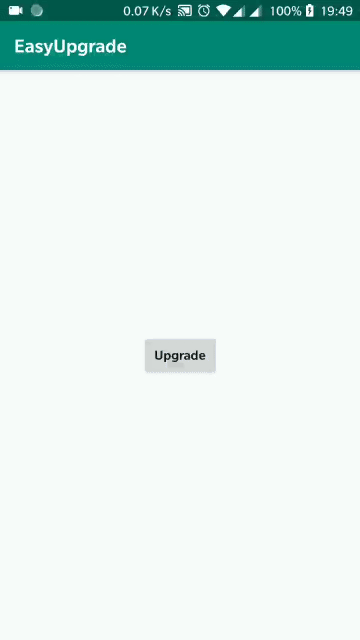

# EasyUpgrade
一行代码搞定应用下载和安装两个步骤，EasyUpagrade有以下优势：
1. 兼容8.0系统；
2. 使用[Pump](https://github.com/huxq17/Pump)进行下载，支持断点， 并且根据http协议做了缓存，可以避免不必要的下载。
3. 使用极其简单

### 配置 build.gradle：
项目根目录的build.gradle：
```
buildscript {
   allprojects {
       repositories {
           jcenter()
       }
   }
    dependencies {
        classpath 'com.buyi.huxq17:agencyplugin:1.1.2'
    }
}
```
App模块的build.gradle：

```
apply plugin: 'service_agency'

dependencies {
<<<<<<< HEAD
    implementation'com.huxq17.easyupgrade:easyupgrade:1.0.2'
    implementation'com.huxq17.pump:download:1.0.8'
    implementation 'com.squareup.okhttp3:okhttp:3.11.0'
}

```
### 用法

```
 EasyUpgrade.with(this).from(apkUrl).upgrade();
```
### FileProvider
应用如果有其他使用fileprovider的需求，例如拍照，相册选取图片等，这个时候不需要再关心fileprovider相关的东西，关于fileprovider和配置都处理好了，只需要拿到authority获取到Uri就行了，其中authority为：

```
 String authority = context.getPackageName() + ".fileProvider-installApk";
```
文件Uri为：

```
Uri fileUri = null;
if (Build.VERSION.SDK_INT >= 24) {
    fileUri = FileProvider.getUriForFile(this, authority, file);
} else {
    fileUri = Uri.fromFile(file);
}
```
大功告成，获取到Uri以后想干嘛就干嘛了。

### 更多
如果想在下载apk的时候给用户显示进度条，可以参考[demo](https://github.com/huxq17/EasyUpgrade/blob/master/app/src/main/java/com/huxq17/easyupgrade/demo/MainActivity.java)

### 效果图




### 关于我
    邮箱：huxq17@163.com

### License

    Copyright (C) 2018 huxq17

    Licensed under the Apache License, Version 2.0 (the "License");
    you may not use this file except in compliance with the License.
    You may obtain a copy of the License at

    http://www.apache.org/licenses/LICENSE-2.0

    Unless required by applicable law or agreed to in writing, software
    distributed under the License is distributed on an "AS IS" BASIS,
    WITHOUT WARRANTIES OR CONDITIONS OF ANY KIND, either express or implied.
    See the License for the specific language governing permissions and
    limitations under the License
